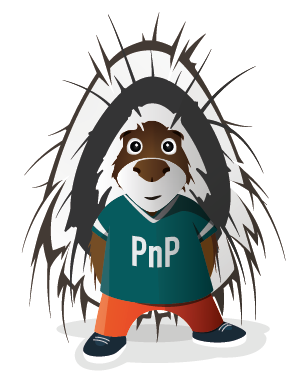

# Prompt Pulse  

| [Overview](/Documentation/Overview.md) | [Deployment guide](/Documentation/Deployment-guide.md)
| ---- | ---- 

Prompt Pulse is a Power App that enables users and administrators to efficiently schedule and manage the sharing of Copilot prompts across Microsoft Teams, group chats, and individual users within an organization.

Assist your organization in mastering the art of prompting to fully utilize Microsoft 365 Copilot.

Microsoft 365 Copilot introduces a novel approach to work, and success is achieved when it becomes habitual to employ Copilot's assistance throughout the workday.
 
Team members can establish these new routines by actively exchanging and embracing fresh prompts in 'Prompt Pulse', which illustrates what’s possible and motivates them to refine their prompting techniques.
 
Utilizing Power Automate, these prompts are automatically distributed to Teams chats/channels or Viva Engage communities based on scheduled timings for regular and reliable updates.

'Prompt Pulse' features a user-friendly interface designed with Power Apps, enabling admins to set schedules, designate specific audiences, and track the distribution of prompts.
 
Deployment is straightforward and quick, not necessitating any premium connectors nor relying on Dataverse. 

Prompt Pulse is mobile friendly 📱and supports dark mode.

For more information check out the [Overview](Documentation/Overview.md)

## Capabilities

Prompt Pulse provides the following capabilities:

- Ability to share a prompt with your team, a group chat, multiple users or Viva Engage.
- Adaptive card notifications for shared prompts.
- A library of prompts which are added to when prompts are shared.
- Ability to schedule prompts in advance to automatically send at a specific date/time.
- Users can like prompts to curate their own personal collection of prompts they find useful.
- Fully mobile responsive Power App so users can share and view prompts on the move.

## Getting Started

To get started please follow the [Deployment guide](Documentation/Deployment-guide.md). 

## Issues

Please report any issues by raising an [issue](https://github.com/pnp/prompt-pulse/issues/new/choose).

## Contributing

We 💖 to accept contributions.

Check out our [Contribution guidelines](/CONTRIBUTING.md) for guidance on how to contribute. 

If you want to get involved with helping us enhance Prompt Pulse, whether that is suggesting or adding new functionality, updating our documentation or fixing bugs, we would love to hear from you.

## Special Thanks

Special thanks to those below who have helped build this awesome solution.

- [@alexc-MSFT](https://github.com/alexc-MSFT)
- [@JoJohnstone](https://github.com/JoJohnstone)

## Support

This solution is open-source and community provided with no active community providing support for it. This solution is maintained by both Microsoft employees and community contributors and is not a Microsoft provided solution so there is no SLA or direct support for this from Microsoft. Please report any issues by raising an [issue](https://github.com/pnp/prompt-pulse/issues/new/choose).

## Microsoft 365 & Power Platform Community

Prompt Pulse is a Microsoft 365 & Power Platform Community (PnP) project. Microsoft 365 & Power Platform Community is a virtual team consisting of Microsoft employees and community members focused on helping the community make the best use of Microsoft products. Prompt Pulse is an open-source project not affiliated with Microsoft and not covered by Microsoft support. If you experience any issues using Provision Assist, please submit an issue in the [issues list](https://github.com/pnp/prompt-pulse/issues).

## "Sharing is Caring"

## Disclaimer

**THIS CODE IS PROVIDED AS IS WITHOUT WARRANTY OF ANY KIND, EITHER EXPRESS OR IMPLIED, INCLUDING ANY IMPLIED WARRANTIES OF FITNESS FOR A PARTICULAR PURPOSE, MERCHANTABILITY, OR NON-INFRINGEMENT.**

## Code of Conduct

This repository has adopted the Microsoft Open Source Code of Conduct. For more information see the [Code of Conduct FAQ](https://opensource.microsoft.com/codeofconduct/faq/) or contact opencode@microsoft.com with any additional questions or comments.
